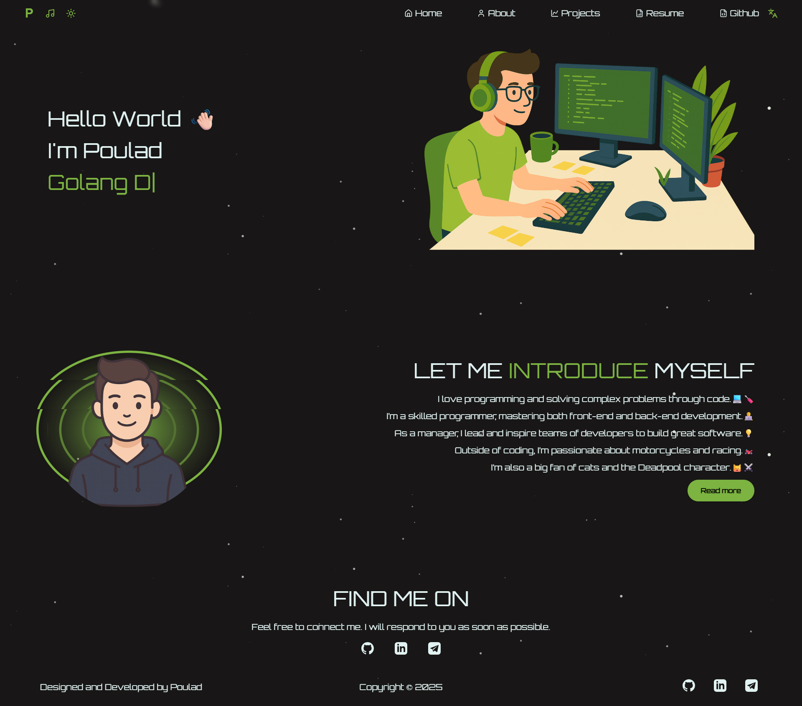

# Portfolio
💼 Portfolio website of me, built with React

<video autoplay loop muted playsinline style="width:100%; max-width:100%;">
  <source src="demo/demo.mp4" type="video/mp4">
</video>

## ✨ Features
- 🌙 **Dark / Light Theme** toggle
- 🌍 **Multi-language support** (i18n-ready)
- 🎵 **Background music** for a better experience
- 🎬 **Smooth animations with GSAP**
- 📦 **State management with Redux**
- 🎨 **UI components powered by Material-UI (MUI)**
- 🔗 **API calls with Axios**
- 🧩 **Modular architecture & Reuseable components**  

---

## 📌 Todos
- [ ] Change fa font
- [ ] Improve TypeScript type
- [ ] Improve **TypeScript typing**
- [ ] Add PWA support  

---

## Demo

  

---

## 👨‍💻 Author
**[Pooulad](https://github.com/pooulad)**  
Full-Stack Developer • Open-Source Enthusiast  

📧 Email: pooulad@email.com  
🐦 Linkedin: [Linkedin](https://www.linkedin.com/in/amir-mahdi-pouladi-803748283)  

---

## 🤝 Support
If you like this project, please ⭐ the repo and consider supporting:

- Buy me a coffee ☕ → [BuyMeACoffee](https://www.coffeebede.com/poulad) 